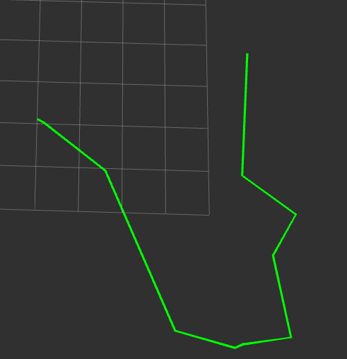
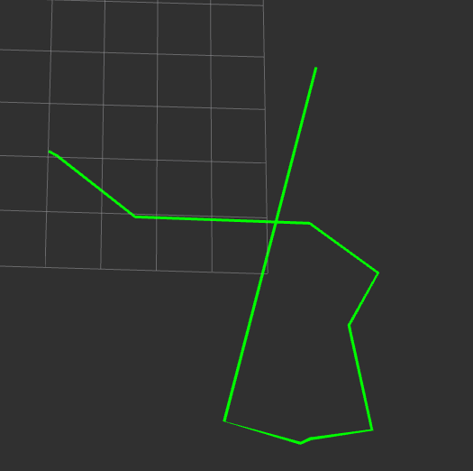

# Route Optimization using ROS

ROS package to visualize different strategies for traversal through a set of points.

### Supported strategies
- [x] Greedy - pick a seed node and iteratively select the nearest neighbor, replacing the seed with the selected node.
- [x] Bruteforce - iterate through all permutations of points and find minimum

An example of the difference between brute force and greedy can be seen in the image below:
Brute force is on the left.
<table>
<tr>
    <td></td>
    <td></td>
</tr>
</table>

### Dependencies
- catkin - see package.xml for specifics
- Google Test (if you want to run tests)
